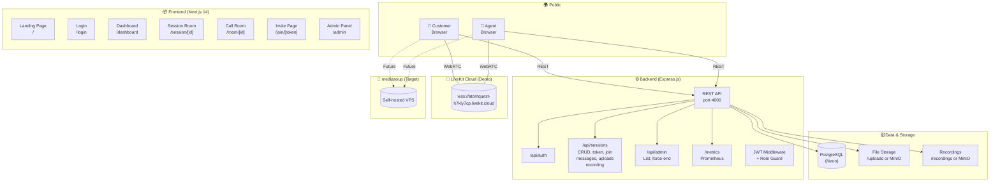
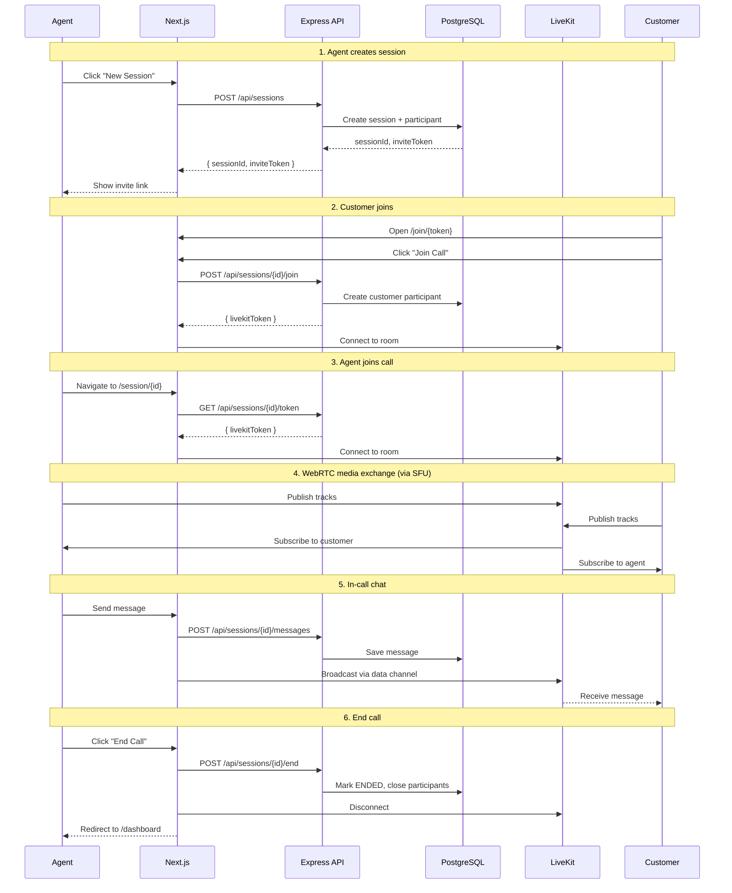
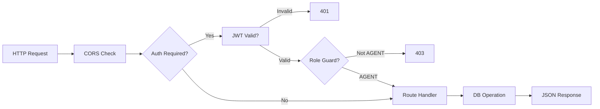
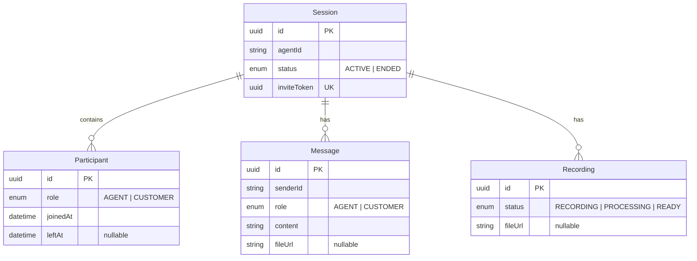
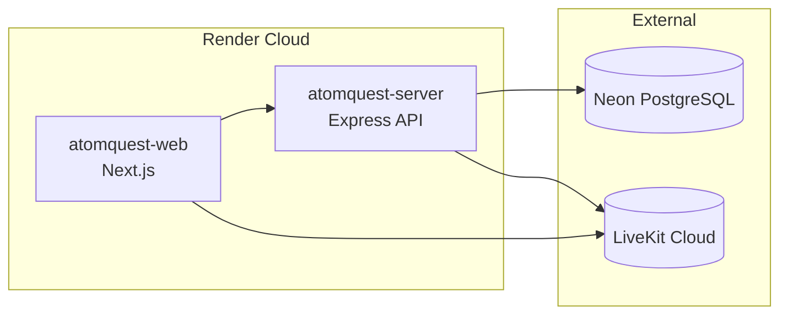

# AtomQuest — Real-Time Video Support Platform

> Enterprise-grade video support with an Apple-grade UI. Built for agents to connect with customers via low-latency WebRTC video calls, in-call chat, file sharing, and session recording.

---

## Table of Contents

- [Overview](#overview)
- [Tech Stack](#tech-stack)
- [Architecture](#architecture)
- [Features](#features)
- [WebRTC / Media Server Strategy](#webrtc--media-server-strategy)
- [Database Schema](#database-schema)
- [API Reference](#api-reference)
- [Authentication Flow](#authentication-flow)
- [Frontend Pages & Components](#frontend-pages--components)
- [State Management](#state-management)
- [Deployment](#deployment)
- [Local Development](#local-development)
- [Environment Variables](#environment-variables)

---

## Overview

AtomQuest is a full-stack video support platform that lets support agents create sessions and invite customers via a shareable link. Once joined, both parties communicate over a real-time video call with:

- **Live video & audio** via WebRTC (SFU architecture)
- **In-call text chat** with file uploads (images, PDFs, documents)
- **Call recording** with downloadable playback
- **Session management** — create, join, end, and review past sessions
- **Admin dashboard** — monitor all sessions, force-end, view recordings

The project is structured as a **pnpm monorepo** with two packages:

| Package | Path | Description |
|---------|------|-------------|
| `@atomquest/server` | `apps/server/` | Express.js REST API + Prisma ORM |
| `@atomquest/web` | `apps/web/` | Next.js 14 App Router frontend |

---

## Tech Stack

| Layer | Technology |
|-------|-----------|
| **Frontend** | Next.js 14 (App Router), React 18, TypeScript |
| **Styling** | Tailwind CSS, Framer Motion |
| **State** | Zustand |
| **Backend** | Express.js, TypeScript |
| **Database** | PostgreSQL (Neon), Prisma ORM |
| **Video (Demo)** | LiveKit Cloud (self-deployed instance) |
| **Video (Target)** | mediasoup SFU |
| **Auth** | JWT (signed tokens, 8h expiry for agents, 24h for customers) |
| **File Storage** | Local filesystem (`/uploads`, `/recordings`) or MinIO (S3-compatible) |
| **Metrics** | Prometheus client (`/metrics` endpoint) |
| **Deployment** | Render (via `render.yaml`) |

---

## Architecture

### System Overview



### Data Flow (Sequence)



### Request Lifecycle



### Data Model



### Deployment (Render)



### Data Flow Summary

1. **Agent** logs in via `/login` → receives JWT → redirected to `/dashboard`
2. **Agent** clicks "New Session" → `POST /api/sessions` → session created with unique `inviteToken`
3. **Agent** shares invite link (`{origin}/join/{inviteToken}`) with customer
4. **Customer** opens link → token validated → clicks "Join Call"
5. **Customer** receives JWT + LiveKit token → redirected to `/room/[id]`
6. **Agent** navigates to `/session/[id]` → both join the same LiveKit room
7. **LiveKit** handles WebRTC negotiation (SFU): video/audio tracks, data channels for chat
8. **Chat messages** are persisted via REST API + broadcasted via LiveKit data channels
9. **Files** are uploaded via REST API, stored locally or in MinIO
10. **Call recording** is managed server-side, stored in `/recordings` or MinIO

---

## Features

### Video Calling
- **SFU architecture** via LiveKit (demo) / mediasoup (target)
- **Picture-in-picture** self-view (draggable)
- **Speaking detection** with animated glow ring and LIVE badge
- **Mute indicator** with microphone-off icon
- **Camera on/off** toggle with initials placeholder
- **Fullscreen mode** for remote participant
- **Drag-to-reposition** local video PiP

### In-Call Chat
- **Real-time messaging** via LiveKit data channels (broadcast to all participants)
- **Message persistence** via REST API (stored in PostgreSQL)
- **File uploads** — images, PDFs, documents (up to 20MB)
- **Image preview** with modal viewer
- **Unread message indicator** on chat toggle button
- **Chat history** loaded on session join

### Session Management
- **Create session** — generates unique invite token and shareable URL
- **Join session** — validate invite token, create participant record, issue JWT
- **End session** — marks session as ENDED, closes participant records
- **Session history** — view past sessions with duration, message count, participants
- **Admin panel** — list all sessions, filter by status, force-end, view recordings

### Authentication
- **Agent login** — demo credentials (`agent` / `atomquest2024`), JWT issued
- **Customer auth** — auto-authenticated via invite token, short-lived JWT
- **Role-based guards** — `AGENT` vs `CUSTOMER` roles enforced on API and frontend routes
- **401 interceptor** — global axios interceptor redirects on expired tokens

### File Sharing
- **Upload via REST** — multipart form upload with MIME type validation
- **Local storage** — files saved to `/uploads` directory
- **MinIO (S3-compatible)** — optional object storage for production
- **Presigned URLs** — secure temporary download links via MinIO
- **File type support** — JPEG, PNG, GIF, WebP, PDF, plain text, Word documents

### Call Recording
- **Server-side recording** — recordings stored in `/recordings` directory
- **Status tracking** — RECORDING → PROCESSING → READY
- **Download** — recordings served with proper Content-Type and Content-Disposition headers
- **Admin view** — see recording status and download URL per session

### UI / UX
- **Dark-first design** with Apple-grade aesthetics
- **Glassmorphism** — backdrop blur, semi-transparent surfaces, subtle borders
- **Animated transitions** — page transitions, component mount animations via Framer Motion
- **Toast notifications** — success, error, warning, info
- **Responsive** — works on desktop and tablet
- **Design system preview** — `/dev` page showcases all components

---

## WebRTC / Media Server Strategy

### Current (Demo): LiveKit Cloud

For the hackathon/demo phase, AtomQuest uses **LiveKit Cloud** — a self-deployed LiveKit instance running on `wss://atomquest-h7kly7cp.livekit.cloud`.

**Why LiveKit for demo:**
- Simple to set up — just API key + secret, no server infrastructure
- Built-in room management, track negotiation, and data channels
- Excellent React hooks library (`@livekit/components-react`)
- Handles TURN/STUN, ICE negotiation, and SFU routing out of the box

**LiveKit is used for:**
- WebRTC SFU — routing video/audio tracks between agent and customer
- Room management — each session is a LiveKit room
- Data channels — broadcasting chat messages in real-time
- Speaking detection — via `useIsSpeaking` hook
- Mute detection — via `useIsMuted` hook

### Target (Production): mediasoup

The landing page and architecture reference **mediasoup** as the intended production media server. The server `.env` still contains mediasoup configuration placeholders (`MEDIASOUP_LISTEN_IP`, `MEDIASOUP_ANNOUNCED_IP`).

**Why mediasoup for production:**
- Fully self-hosted — no dependency on third-party cloud services
- Lower latency — direct UDP transport between peers and SFU
- No per-minute pricing — pay only for your server infrastructure
- Full control — customize SFU behavior, simulcast, SVC, etc.

**Why not LiveKit in production:**
- LiveKit Cloud has per-minute pricing that scales with usage
- Self-hosting LiveKit requires Kubernetes or dedicated infrastructure
- mediasoup is more lightweight and deployable on a single VPS

**Migration path:**
1. Deploy mediasoup worker on a VPS with a public IP
2. Replace LiveKit room/track management with mediasoup's `Router`, `Transport`, `Producer`/`Consumer` APIs
3. Replace `@livekit-components-react` hooks with custom WebRTC hooks using mediasoup's client library
4. Keep the same UI components — only the underlying media layer changes

---

## Database Schema

```prisma
enum Role { AGENT, CUSTOMER }
enum SessionStatus { ACTIVE, ENDED }
enum RecordingStatus { RECORDING, PROCESSING, READY }

model Session {
  id          String        @id @default(uuid())
  agentId     String
  status      SessionStatus @default(ACTIVE)
  inviteToken String        @unique @default(uuid())
  createdAt   DateTime      @default(now())
  endedAt     DateTime?
  participants Participant[]
  messages     Message[]
  recordings   Recording[]
}

model Participant {
  id        String   @id @default(uuid())
  sessionId String
  role      Role
  joinedAt  DateTime @default(now())
  leftAt    DateTime?
  session   Session  @relation(fields: [sessionId], references: [id], onDelete: Cascade)
}

model Message {
  id        String   @id @default(uuid())
  sessionId String
  senderId  String
  role      Role
  content   String
  fileUrl   String?
  fileType  String?
  fileName  String?
  createdAt DateTime @default(now())
  session   Session  @relation(fields: [sessionId], references: [id], onDelete: Cascade)
}

model Recording {
  id        String          @id @default(uuid())
  sessionId String
  status    RecordingStatus @default(RECORDING)
  fileUrl   String?
  createdAt DateTime        @default(now())
  session   Session         @relation(fields: [sessionId], references: [id], onDelete: Cascade)
}
```

---

## API Reference

### Authentication

| Method | Endpoint | Auth | Description |
|--------|----------|------|-------------|
| `POST` | `/api/auth/agent-login` | None | Agent login with demo credentials |

### Sessions

| Method | Endpoint | Auth | Description |
|--------|----------|------|-------------|
| `GET` | `/api/sessions` | Agent | List all sessions |
| `POST` | `/api/sessions` | Agent | Create a new session |
| `GET` | `/api/sessions/by-token/:token` | None | Resolve invite token → session ID |
| `GET` | `/api/sessions/:id` | Agent | Get session details |
| `GET` | `/api/sessions/:id/token` | Agent | Get LiveKit token for a session |
| `POST` | `/api/sessions/:id/join` | None | Customer joins via invite token |
| `POST` | `/api/sessions/:id/end` | Agent | End a session |
| `GET` | `/api/sessions/:id/history` | Agent | Full session history with messages |
| `GET` | `/api/sessions/:id/messages` | Agent | Message history |
| `POST` | `/api/sessions/:id/messages` | Agent | Send a message |
| `POST` | `/api/sessions/:id/upload` | Agent | Upload a file |
| `GET` | `/api/sessions/:id/recording` | Agent | Get recording status |

### Admin

| Method | Endpoint | Auth | Description |
|--------|----------|------|-------------|
| `GET` | `/api/admin/sessions` | Agent | List all sessions (with recordings) |
| `POST` | `/api/admin/sessions/:id/force-end` | Agent | Force-end a session |

### Monitoring

| Method | Endpoint | Auth | Description |
|--------|----------|------|-------------|
| `GET` | `/metrics` | None | Prometheus metrics |
| `GET` | `/api/health` | None | Health check |

---

## Authentication Flow

```
Agent Login:
  POST /api/auth/agent-login { username, password }
  → JWT (8h expiry) stored in Zustand authStore
  → All subsequent requests include Authorization: Bearer <token>

Customer Join:
  Opens /join/{inviteToken}
  → POST /api/sessions/{sessionId}/join { inviteToken }
  → JWT (24h expiry) + LiveKit token returned
  → Redirected to /room/{sessionId}

Token Validation:
  Server middleware: authenticateJWT verifies JWT, attaches user to req
  Role guard: requireRole('AGENT') or requireRole('CUSTOMER')
  Frontend: ProtectedRoute component wraps pages, redirects if unauthenticated
  Global 401 interceptor: axios interceptor logs out and redirects on 401
```

---

## Frontend Pages & Components

### Pages

| Route | Role | Description |
|-------|------|-------------|
| `/` | Public | Landing page with invite code input |
| `/login` | Public | Agent login form |
| `/dashboard` | Agent | Session list, create new session, copy invite link |
| `/session/[id]` | Agent | Active call room with chat, recording, controls |
| `/join/[token]` | Public | Customer invite page — validates token, join button |
| `/room/[id]` | Customer | Active call room (customer view) |
| `/admin` | Agent | Admin panel — all sessions, force-end, recordings |
| `/dev` | Public | Design system preview (dev only) |

### Key Components

| Component | Location | Description |
|-----------|----------|-------------|
| `VideoTile` | `components/video/VideoTile.tsx` | Video participant tile with speaking/mute indicators, PiP support |
| `CallRoom` | `components/video/CallRoom.tsx` | Full call layout — remote video, local PiP, toolbar, chat panel |
| `CallToolbar` | `components/video/CallToolbar.tsx` | Mic, camera, chat, end call controls |
| `ChatPanel` | `components/ui/ChatPanel.tsx` | In-call chat with messages, file uploads, image preview |
| `Glass` | `components/ui/Glass.tsx` | Glassmorphism card container |
| `Button` | `components/ui/Button.tsx` | Styled button with variants (primary, ghost, danger, icon) |
| `Toast` | `components/ui/Toast.tsx` | Toast notification system |
| `PageTransition` | `components/layout/PageTransition.tsx` | Framer Motion page wrapper |
| `ProtectedRoute` | `components/auth/ProtectedRoute.tsx` | Role-based route guard |
| `ImageModal` | `components/ui/ImageModal.tsx` | Full-screen image preview modal |

---

## State Management

### authStore (`stores/authStore.ts`)
- `token`, `agentId`, `role`, `sessionId`, `participantId`
- Actions: `login`, `setCustomerAuth`, `setAgentAuth`, `logout`, `isAuthenticated`
- Global axios 401 interceptor

### sessionStore (`stores/sessionStore.ts`)
- `sessions`, `currentSession`, `inviteUrl`, `isLoading`, `error`
- Actions: `createSession`, `fetchSessions`, `fetchSession`, `endSession`, `joinSession`, `setInviteUrl`, `clearCurrent`

---

## Deployment

The project is configured for deployment on **Render** via `render.yaml`.

### Services

1. **atomquest-server** — Express API (Node)
   - Build: `pnpm install && pnpm --filter @atomquest/server db:generate && pnpm --filter @atomquest/server build`
   - Start: `pnpm --filter @atomquest/server start`

2. **atomquest-web** — Next.js frontend (Node)
   - Build: `pnpm install && pnpm --filter @atomquest/web build`
   - Start: `pnpm --filter @atomquest/web start`

### Required Environment Variables (set in Render dashboard)

**Server:**
- `DATABASE_URL` — PostgreSQL connection string (Neon)
- `LIVEKIT_URL` — LiveKit WebSocket URL
- `LIVEKIT_API_KEY` — LiveKit API key
- `LIVEKIT_API_SECRET` — LiveKit API secret
- `JWT_SECRET` — auto-generated by Render
- `WEB_ORIGIN` — frontend URL (for invite links)

**Frontend:**
- `NEXT_PUBLIC_API_URL` — backend server URL
- `NEXT_PUBLIC_LIVEKIT_URL` — LiveKit WebSocket URL

---

## Local Development

### Prerequisites

- Node.js 18+
- pnpm 8+
- PostgreSQL (or Neon account)

### Setup

```bash
# 1. Install dependencies
pnpm install

# 2. Set up environment files
cp apps/server/.env.example apps/server/.env
# Edit apps/server/.env with your DATABASE_URL, LiveKit credentials, etc.

# 3. Generate Prisma client and run migrations
pnpm --filter @atomquest/server db:generate
pnpm --filter @atomquest/server db:migrate

# 4. Start the backend
pnpm --filter @atomquest/server dev

# 5. In another terminal, start the frontend
pnpm --filter @atomquest/web dev
```

The backend runs on `http://localhost:4000` and the frontend on `http://localhost:3000`.

### Demo Credentials

- **Username:** `agent`
- **Password:** `atomquest2024`

---

## Environment Variables

### Server (`apps/server/.env`)

| Variable | Default | Description |
|----------|---------|-------------|
| `DATABASE_URL` | — | PostgreSQL connection string |
| `JWT_SECRET` | — | Secret for signing JWTs |
| `CORS_ORIGIN` | `*` | CORS allowed origins |
| `WEB_ORIGIN` | `http://localhost:3000` | Frontend URL (for invite links) |
| `PORT` | `4000` | Server port |
| `HOST` | `0.0.0.0` | Server host |
| `LIVEKIT_URL` | — | LiveKit WebSocket URL |
| `LIVEKIT_API_KEY` | — | LiveKit API key |
| `LIVEKIT_API_SECRET` | — | LiveKit API secret |
| `MINIO_ENDPOINT` | — | MinIO endpoint (optional) |
| `MINIO_ACCESS_KEY` | — | MinIO access key (optional) |
| `MINIO_SECRET_KEY` | — | MinIO secret key (optional) |

### Frontend (`apps/web/.env`)

| Variable | Default | Description |
|----------|---------|-------------|
| `NEXT_PUBLIC_API_URL` | `http://localhost:4000` | Backend API URL |
| `NEXT_PUBLIC_LIVEKIT_URL` | — | LiveKit WebSocket URL |
| `NEXT_PUBLIC_WEB_ORIGIN` | `http://localhost:3000` | Frontend origin (for invite links) |

---

## License

MIT — built for the hackathon/demo phase.